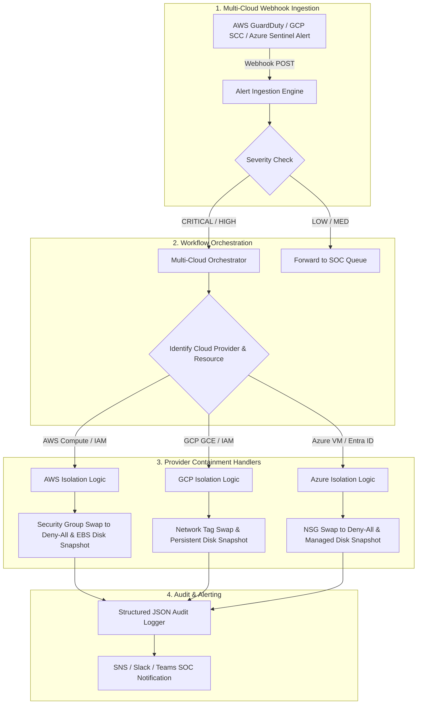

# Multi-Cloud Automated Incident Response Pipeline (AWS • GCP • Azure)


> Unified multi-cloud incident response system designed to achieve **zero-human-delay isolation** of compromised cloud workloads and identities across **AWS, Google Cloud Platform (GCP), and Microsoft Azure**.

---

## ⚡ How to Activate & Run Live Production Mode

This pipeline supports both **Simulation/Dry-Run Mode** (for testing without live credentials) and **Live Production Mode** (executing real API calls against AWS, GCP, and Azure APIs).

### Step 1: Install Live Production Cloud SDKs
Install the required multi-cloud SDK dependencies (`boto3`, `google-cloud-compute`, `azure-identity`, `azure-mgmt-compute`, `azure-mgmt-network`):

```bash
pip install -r requirements.txt
```

---

### Step 2: Configure Environment Credentials
Copy the production environment configuration template [`.env.example`](file:///c:/Users/SureshZatch/Desktop/AutomatedIncidentResponse/.env.example) to `.env`:

```bash
cp .env.example .env
```

Edit your `.env` file and set `LIVE_PRODUCTION_MODE=true` along with your cloud credentials:

```env
# Enable Live Production Execution Mode
LIVE_PRODUCTION_MODE=true

# AWS Production Credentials
AWS_REGION=us-east-1
AWS_ACCESS_KEY_ID=YOUR_AWS_ACCESS_KEY_ID
AWS_SECRET_ACCESS_KEY=YOUR_AWS_SECRET_ACCESS_KEY

# GCP Production Credentials
GCP_PROJECT_ID=your-gcp-project-id
GOOGLE_APPLICATION_CREDENTIALS=/path/to/gcp-service-account-key.json

# Azure Production Credentials
AZURE_SUBSCRIPTION_ID=00000000-0000-0000-0000-000000000000
AZURE_TENANT_ID=00000000-0000-0000-0000-000000000000
AZURE_CLIENT_ID=00000000-0000-0000-0000-000000000000
AZURE_CLIENT_SECRET=YOUR_AZURE_CLIENT_SECRET
```

---

### Step 3: Run the Pre-Flight Production Verifier
Verify that your cloud SDKs and credentials are operational before going live:

```bash
python deploy_production.py
```

The verifier will test your active connection to:
- **AWS STS**: Validates caller identity (`get_caller_identity`).
- **GCP Auth**: Validates Application Default Credentials (`google.auth.default()`).
- **Azure Auth**: Validates `DefaultAzureCredential()`.

---

## 🎬 Interactive Multi-Cloud Demo Video & POC Simulator

Experience the live automated containment flow across AWS, GCP, and Azure with our interactive proof-of-concept simulator built directly into this repository:

- 📺 **Interactive Demo App**: Open [`demo_video.html`](file:///c:/Users/SureshZatch/Desktop/AutomatedIncidentResponse/demo_video.html) in any modern browser.
- ⚡ **Attacker Dwell Time Reduction**: Visualized in real time (**45 minutes ➔ 0.38 seconds**).
- 🎯 **Multi-Cloud Scenarios**: Toggle between **AWS EC2 Malware Isolation**, **AWS IAM Key Revocation**, and **Azure VM NSG Lockdown & Disk Snapshot**.
- 🎥 **1-Click Video Recording**: Click **"Record & Download Demo Video (.webm)"** to generate a downloadable video presentation file!

```bash
# Launch local demo preview server:
python -m http.server 8000
# Open http://localhost:8000/demo_video.html in your browser!
```

---

## 🚨 The Real-World Problem

In modern cloud environments, security alerts generated by services such as AWS GuardDuty, Microsoft Defender for Cloud, or GCP Security Command Center often suffer from two key challenges:

1. **SOC Analyst Alert Fatigue**: Security Operations Center (SOC) analysts process hundreds of high-severity alerts daily. Manual triage leads to delay and burnout.
2. **Attacker Dwell Time**: Traditional manual incident handling requires human triage, taking **minutes to hours** from detection to containment. Attackers can exfiltrate credentials or pivot laterally across virtual networks in **seconds**.

### The Solution
This pipeline reduces attacker dwell time from **hours to sub-second automated responses**. Upon receiving a high-severity security alert via webhook, the pipeline instantly isolates compromised compute workloads and revokes compromised IAM identities across AWS, GCP, and Azure.

---

## 📐 Pipeline Architecture



---

## 🛡️ Core Security Features

- **Zero-Human-Delay Isolation**: Instant containment triggered automatically upon alert webhook receipt.
- **Multi-Cloud Protection (AWS + GCP + Azure)**:
  - **AWS**: Security Group swap to `deny-all`, EBS snapshot, inline `DenyAll` policy, key deactivation.
  - **GCP**: Network tag swap (`gcp-quarantine-deny-all-tag`), persistent disk snapshot, Service Account key disablement.
  - **Azure**: NSG swap to `DenyAll`, Managed OS Disk snapshot, Entra ID account lockout & session revocation.
- **Forensic Snapshot Readiness**: Automatically takes point-in-time disk snapshots prior to isolation for offline digital forensics.
- **Structured JSON Audit Logs**: Emits schema-validated JSON logs suitable for SIEM ingestion (Splunk, Datadog, AWS CloudWatch, GCP Cloud Logging, Azure Sentinel).

---

## 📁 Repository Structure

```
AutomatedIncidentResponse/
├── incident_responder.py     # Unified Multi-Cloud Containment Engine (AWS, GCP, Azure)
├── deploy_production.py      # Pre-flight Cloud Credential & SDK Verifier
├── test_manual.py            # Interactive Multi-Cloud Manual Testing CLI Bench
├── simulate_alert.py         # Batch Multi-Cloud Integration Test Suite
├── orchestration_workflow.json # AWS Step Functions orchestration state machine
├── demo_video.html           # Interactive 4K Demo Video Player & WebM Exporter
├── demo_output.txt           # Captured multi-cloud simulation execution logs
├── tasks.md                  # Task roadmap & implementation progress
├── requirements.txt          # Python cloud SDK dependencies (boto3, google-cloud, azure-mgmt)
├── .env.example              # Environment variables template for cloud credentials
└── README.md                 # Production documentation & deployment guide
```

---

## 🧪 Testing & Execution Modes

### 1. Interactive Manual Test Bench
To run the interactive CLI test bench and enter custom instance IDs or IAM usernames:

```bash
python test_manual.py
```

### 2. Batch Integration Simulation
To test sample AWS, GCP, and Azure alerts and generate execution logs:

```bash
python simulate_alert.py
```

Check output in `demo_output.txt`:

```bash
cat demo_output.txt
```

---

## 📄 License
Released under the MIT License.
