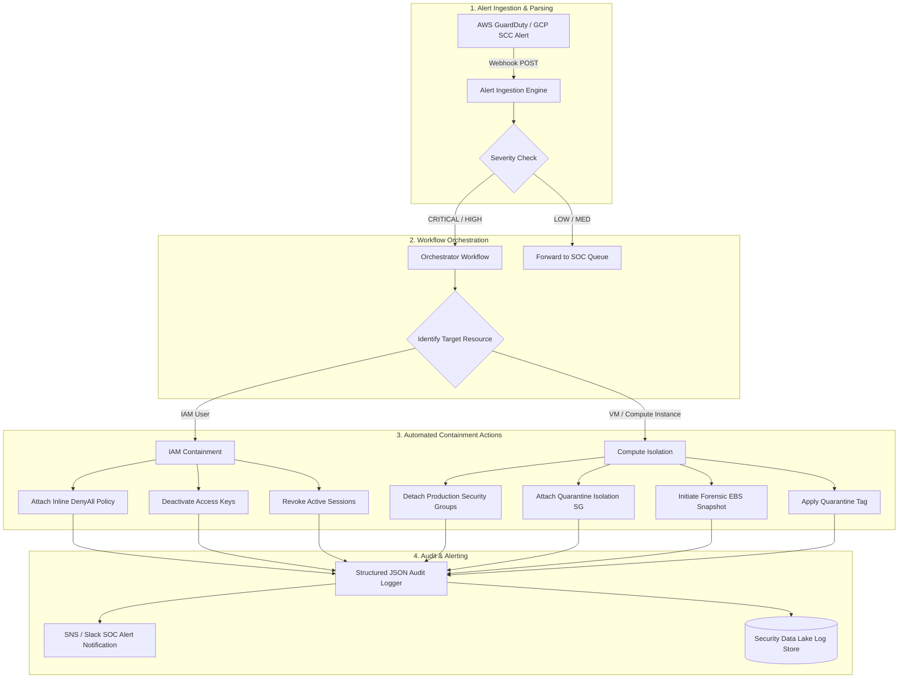

# Multi-Cloud Automated Incident Response Pipeline (AWS • GCP • Azure)


> Unified multi-cloud incident response system designed to achieve **zero-human-delay isolation** of compromised cloud workloads and identities across **AWS, Google Cloud Platform (GCP), and Microsoft Azure**.

---

## 🎬 Interactive Multi-Cloud Demo Video & POC Simulator

Experience the live automated containment flow across AWS, GCP, and Azure with our interactive proof-of-concept simulator built directly into this repository:

- 📺 **Interactive Demo App**: Open [`demo_video.html`](file:///c:/Users/SureshZatch/Desktop/AutomatedIncidentResponse/demo_video.html) in any modern browser.
- ⚡ **Attacker Dwell Time Reduction**: Visualized in real time (**45 minutes ➔ 0.38 seconds**).
- 🎯 **Multi-Cloud Scenarios**: Toggle between **AWS EC2 Malware Isolation**, **AWS IAM Key Revocation**, and **Azure VM NSG Lockdown & Disk Snapshot**.


```bash
# Launch local demo preview server:
python -m http.server 8000
# Open http://localhost:8000/demo_video.html in your browser!
```

---


## 🚨 The Real-World Problem

In modern cloud environments, security alerts generated by services such as AWS GuardDuty, Microsoft Defender for Cloud, or GCP Security Command Center often suffer from two key challenges:

1. **SOC Analyst Alert Fatigue**: Security Operations Center (SOC) analysts process hundreds of high-severity alerts daily. Manual triage leads to delay and burnout.
2. **Attacker Dwell Time**: Traditional manual incident handling requires human triage, taking **minutes to hours** from detection to containment. Attackers can exfiltrate credentials or pivot laterally across virtual networks in **seconds**.

### The Solution
This pipeline reduces attacker dwell time from **hours to sub-second automated responses**. Upon receiving a high-severity security alert via webhook, the pipeline instantly isolates compromised compute workloads and revokes compromised IAM identities.

---

## 📐 Pipeline Architecture



---

## 🛡️ Core Security Features

- **Zero-Human-Delay Isolation**: Instant containment triggered automatically upon alert webhook receipt.
- **Least-Privilege & Defense-in-Depth**:
  - **IAM User Containment**: Attaches timestamp-bound `DenyAll` policies, deactivates credentials, and terminates active SSO/OAuth tokens.
  - **Compute Workload Isolation**: Strips production ingress/egress security groups and attaches a zero-traffic quarantine security group (`deny-all`).
- **Forensic Snapshot Readiness**: Automatically takes point-in-time EBS disk snapshots prior to isolation for deep digital forensics and incident investigation.
- **Structured JSON Audit Logs**: Emits schema-validated JSON logs suitable for SIEM ingestion (Splunk, Datadog, AWS CloudWatch, GCP Cloud Logging).
- **Multi-Cloud Ready Orchestration**: Includes AWS Step Functions & GCP Workflows JSON template (`orchestration_workflow.json`).

---

## 📁 Repository Structure

```
AutomatedIncidentResponse/
├── prompt.md                 # Project requirement & build specification
├── tasks.md                  # Detailed task roadmap and progress tracker
├── .gitignore                # Environment, credential, and cache exclusions
├── incident_responder.py     # Core Python containment engine (IAM & Compute)
├── orchestration_workflow.json # AWS Step Functions / Workflows orchestration definition
├── simulate_alert.py         # Integration test suite & webhook alert simulator
├── demo_output.txt           # Captured simulation containment JSON execution logs
└── README.md                 # Project documentation and architectural overview
```

---

## 🚀 Quick Start & Local Execution

### Prerequisites
- Python 3.9+ installed

### Step 1: Run the Integration Test Simulation
To trigger simulated security webhooks and observe automated containment execution:

```bash
python simulate_alert.py
```

### Step 2: Inspect Execution Logs
Check the generated `demo_output.txt` for full step-by-step JSON containment logs:

```bash
cat demo_output.txt
```

Example JSON log snippet from `demo_output.txt`:

```json
{
  "incident_id": "ALERT-2026-8801",
  "containment_type": "COMPUTE_NETWORK_ISOLATION",
  "target_resource": "i-0a8b9c1d2e3f45678",
  "status": "SUCCESSFUL_CONTAINMENT",
  "steps": [
    {
      "action": "modify_instance_security_groups",
      "target": "i-0a8b9c1d2e3f45678",
      "detached_security_groups": [
        "sg-0123456789abcdef0-web-prod",
        "sg-0fedcba9876543210-default"
      ],
      "attached_security_group": "sg-099a88b77c66d55e4-quarantine-deny-all",
      "inbound_rules": "DENY_ALL",
      "outbound_rules": "DENY_ALL",
      "status": "EXECUTED_SUCCESS"
    },
    {
      "action": "create_forensic_snapshot",
      "target_volume": "vol-ebs-0a8b9c1d2e3f45678",
      "snapshot_id": "snap-forensic-alert-2026-8801-i-0a8b9c1d2e3f45678",
      "status": "EXECUTED_SUCCESS"
    }
  ]
}
```

---

## 🔧 Production Deployment Strategy

1. **Lambda / Cloud Function Package**: Deploy `incident_responder.py` as an AWS Lambda function or GCP Cloud Function.
2. **Orchestrator Import**: Import `orchestration_workflow.json` into AWS Step Functions or GCP Workflows.
3. **Event Source Mapping**: Route AWS GuardDuty / EventBridge or GCP SCC notifications directly to the Orchestration Workflow trigger.

---

## 📄 License
Released under the MIT License.
